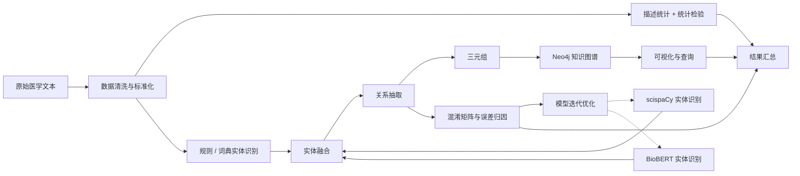

# CBLUE 中文生物医学文本理解实验平台

这是一个按开题报告整理的 CBLUE 项目，里面放了 CMeEE 实体抽取、CMeIE 关系抽取、KUAKE-QIC 文本分类、Mann-Whitney U 检验、Neo4j 导出和 Streamlit 页面。

## 选题背景与价值

中文医疗文本里有不少专业词，也常见口语化表达，句子之间还经常互相依赖。CBLUE 刚好能用来做实体识别、关系抽取和意图分类这几类任务。

这个课题主要想解决的是：

- 给门诊导诊、病历整理和医学知识整理提供一个基础样例
- 把分类、抽取、统计检验和知识图谱连起来
- 做出一个可以直接运行的 Demo

## 问题定义

这个项目主要看三件事：

1. 如何在 CMeEE 中识别医学实体并量化抽取效果
2. 如何在 CMeIE 中抽取关系三元组并构建可导入 Neo4j 的知识图谱
3. 如何在 KUAKE-QIC 中结合本地训练日志呈现中文预训练模型的分类效果

另外还加了一个规则型分诊 Demo，用来演示从主诉到科室推荐的过程。

## 技术路线



图里的虚线表示对照实验和后续迭代分支。

## 实验设计与评价指标

### 1. CMeEE 实体抽取

- 方法：训练集高频实体的词典匹配
- 指标：Precision、Recall、F1
- 当前结果：`F1 = 0.3082`

### 2. KUAKE-QIC 文本分类

- 方法：读取本地 `chinese-bert-wwm-ext` 训练日志里的最佳开发集结果
- 指标：Accuracy
- 当前结果：`0.8163682864450128`

### 3. 统计显著性检验

- 方法：Mann-Whitney U 检验
- 目的：看两组多次实验分数差异是否明显
- 当前结果：`p = 0.007937`

### 4. CMeIE 知识图谱

- 方法：抽取 CMeIE 关系三元组，去重后导出
- 产物：`knowledge_triples.csv` 与 `neo4j_import.cypher`
- 当前规模：`150` 条三元组

## 仓库内容完整度

仓库里现在有：

- 核心代码：`cblue_project/`
- 可视化 Demo：`ui/triage_simple_app.py`
- 报告生成脚本：`scripts/build_artifacts.py`
- 结果产物：`data/generated/`
- 说明文档：`README.md`、`docs/opening_report_mapping.md`
- 依赖文件：`requirements.txt`、`environment.yaml`
- 实验笔记本：`notebooks/cblue_demo.ipynb`

## 技术实现进展

目前已经做好的内容有：

- 读取本地 CBLUE 数据集并生成统计摘要
- 从 CMeEE 构造词典基线并计算 F1
- 从 KUAKE-QIC 日志提取最佳开发集准确率
- 对多次实验分数执行 Mann-Whitney U 检验
- 从 CMeIE 抽取三元组并导出 Neo4j 导入脚本
- 用 Streamlit 展示实验结果和分诊 Demo

## 运行说明

### 环境安装

```powershell
pip install -r requirements.txt
```

### 生成实验产物

```powershell
python scripts/build_artifacts.py
```

### 启动展示界面

```powershell
streamlit run ui/triage_simple_app.py
```

运行后会生成：

- `data/generated/data_report.json`
- `data/generated/evaluation_report.json`
- `data/generated/stats_report.json`
- `data/generated/knowledge_triples.csv`
- `data/generated/neo4j_import.cypher`
- `data/generated/summary.md`

## 中期阶段完成度

现在这个版本已经有：

- 数据处理流程
- 实验指标展示
- 显著性检验结果
- 知识图谱导出
- 在线 Demo
- GitHub 仓库交付材料

后面还可以继续补更大的模型重训和更完整的对照实验。

## 展示与交付质量

仓库现在是这样：

- 结构清晰，代码、文档、产物分离明确
- README 能直接说明研究目标、技术路线和运行方式
- 生成物可直接用于展示和答辩
- 大文件已排除出 GitHub 提交，避免仓库不可用

## 与开题报告对应关系

| 开题报告任务 | 仓库里对应的内容 |
| --- | --- |
| 使用 CBLUE 数据集 | 读取本地 `CBLUEDatasets` 中 CMeEE、CMeIE、KUAKE-QIC |
| 采用 chinese-bert-wwm-ext | 读取本地训练日志中的最佳开发集准确率，保留模型路径约定 |
| 计算 F1 等指标 | `cblue_project/evaluation.py` 提供 CMeEE 微平均 Precision/Recall/F1 |
| Mann-Whitney U 检验 | `cblue_project/stats.py` 输出 U 值、p 值与显著性 |
| Neo4j 知识图谱 | `cblue_project/kg.py` 导出 CSV 与 Cypher |
| Demo 展示 | `ui/triage_simple_app.py` 展示指标、图谱样例和智能分诊 |
| GitHub 仓库材料 | README、requirements、environment、.gitignore 已补齐 |

## Neo4j 导入

先运行：

```powershell
python scripts/build_artifacts.py
```

再把 `data/generated/neo4j_import.cypher` 放入 Neo4j Browser 或 `cypher-shell` 执行，即可创建实体节点和 `RELATED_TO` 关系。

## 说明

本仓库默认不提交 `CBLUEDatasets`、预训练模型和训练输出，因为这些文件较大，且部分文件超过 GitHub 普通仓库限制。若需要复现实验，请将数据和模型按上面的目录结构放回本地。
